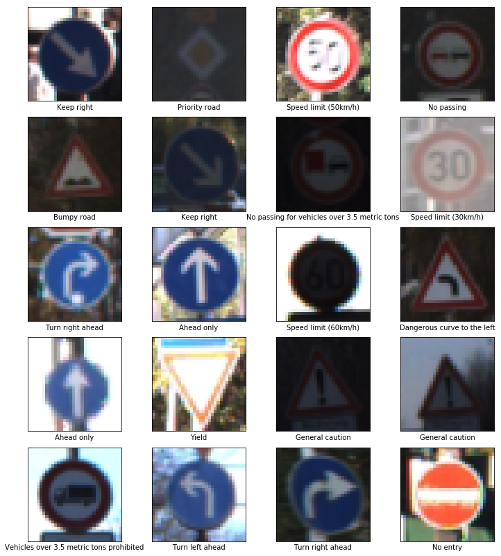
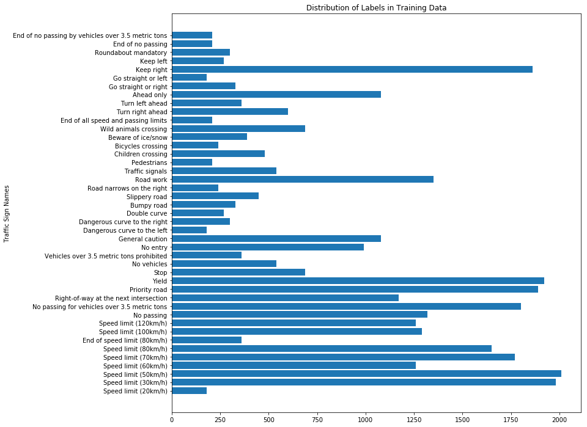
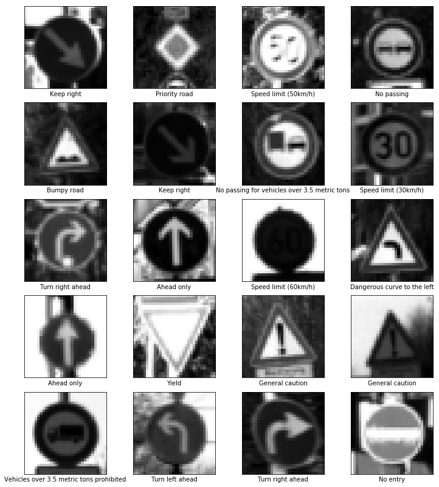
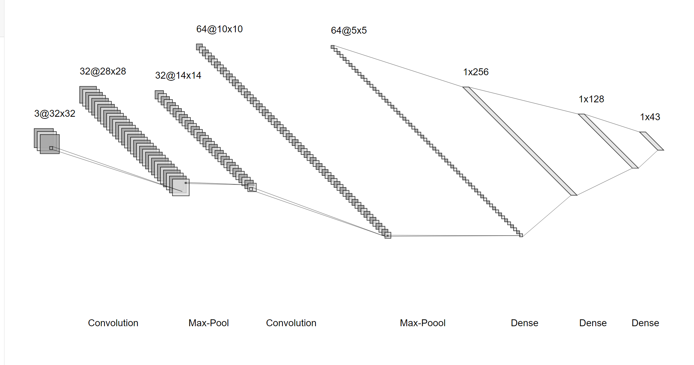
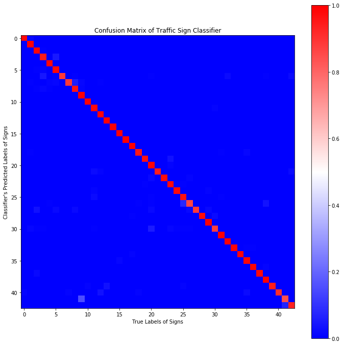

# Traffic Sign Classifier Using
## Using Convolutional Neural Networks with Droput and Batch Normalization

## Overview

Using Tensorflow, I create a convolutional neural network with drop and batch normalization techniques in order to classify German traffic signs. My model achieved 97.5% accuracy on a test set.

## Data Exploration

Quick overview of the dataset, which consists of a total of 51839 images of 43 different traffic signs.

    Total number of examples = 51839
    Number of training examples = 34799
    Number of validation examples = 4410
    Number of testing examples = 12630
    Number of classes = 43
    
#### Sample Images

Here is a sample of 20 images from the dataset.



#### Distribution of Signs in Training Data

For the most part, the model had a good amount of images for each. This will prevent problems where some signs are rarely seen and are not fully learned by the model.



### Image Preprocessing

The CNN expects images to be preprocessed to ensure good performance. The model expects images which are already cropped to 32x32 and zoomed into the traffic sign. Images can easily be rescaled to 32x32 with OpenCV's _resize_ method. The dataset was already cropped to 32x32.

The traffic signs are, for the most part, color independent. Thus, changing images to gray reduces dimensionality of the image which promotes quicker convergance for the model. In addition to this, rescaling the input improves model training.

- Input of 32x32x3 RGB image
- Converted to gray
- Scaled from 0 to 1
- Ouput of 32x32x1

```python
import cv2

def grayscale(image):
    """Converts image to grayscale
    """
    image = np.copy(image)
    return cv2.cvtColor(image, cv2.COLOR_RGB2GRAY)

def scale(image, min_value=0, max_value=1):
    """Converts image to magnitude between a min/max
    """
    image = np.copy(image)
    return min_value + max_value*(image/np.max(image))

def preprocess(image):
    """Preprocessing pipeline
    Image->Gray->Scale->Output
    """
    image = np.copy(image)
    gray = grayscale(image)
    scaled = scale(gray)
    result = np.expand_dims(scaled, axis=2)
    return result
```

Here is the same 20 images after preprocessing.



### Model Architecture

Visualization of the CNN with each convolution activated with ReLu


2 Layers of Convolutions
Conv->Batch Norm->Relu->Max Pool->
2 Layers of Fully Connected
Dense->Batch Norm->Relu->Dropout->
Ouput
Dense->Softmax

Batch normalization is used throughout all layers, except the output. Batch normalization has been shown to improve training by reudcing covariance shift. More simply, it prevents overfitting and makes the model more robust to changes in images.

The fully connected layers also include dropout during training. This works by deactivating half the nodes on each layer to create redundancy in classification. Which in turn reduces overfitting and makes the model generalize better.

The output is put through softmax to extract out probablilities of each classification.

### Training
For training I used Tensorflow's _tf.train.AdamOptimzer_ as the optimizer which is commonly used to optimize the loss function.
The loss function was created by cross entropy with softmax activation. Although, optimization was doing using the output before softmax, since it is more stable.

```python
cross_entropy = tf.reduce_mean(tf.nn.softmax_cross_entropy_with_logits(labels=one_hot_output, logits=logits))
with tf.control_dependencies(tf.get_collection(tf.GraphKeys.UPDATE_OPS)):
    optimizer = tf.train.AdamOptimizer(learning_rate).minimize(cross_entropy)
```

Training ran until the validation accuracy no longer increased in 3 epochs
Weights were intiliazied with _tf.truncated_normal(shape, mean=mu, stddev=sigma)_

    n_epochs = 100 # Max epochs
    batch_size = 32
    learning_rate = 0.001
    patience = 3
    
    mu = 0
    sigma = 0.1
    
    Epoch:  1, Training Loss: 0.5297, Training Accuracy: 0.9232, Validation Loss: 0.6997, Validation Accuracy: 0.8624
    Epoch:  2, Training Loss: 0.1881, Training Accuracy: 0.9796, Validation Loss: 0.3147, Validation Accuracy: 0.9454
    Epoch:  3, Training Loss: 0.0947, Training Accuracy: 0.9913, Validation Loss: 0.2339, Validation Accuracy: 0.9583
    Epoch:  4, Training Loss: 0.0520, Training Accuracy: 0.9962, Validation Loss: 0.1676, Validation Accuracy: 0.9683
    Epoch:  5, Training Loss: 0.0264, Training Accuracy: 0.9980, Validation Loss: 0.1337, Validation Accuracy: 0.9721
    Epoch:  6, Training Loss: 0.0230, Training Accuracy: 0.9978, Validation Loss: 0.1100, Validation Accuracy: 0.9776
    Epoch:  7, Training Loss: 0.0113, Training Accuracy: 0.9990, Validation Loss: 0.0772, Validation Accuracy: 0.9857
    Epoch:  8, Training Loss: 0.0086, Training Accuracy: 0.9994, Validation Loss: 0.0749, Validation Accuracy: 0.9850
    Epoch:  9, Training Loss: 0.0154, Training Accuracy: 0.9984, Validation Loss: 0.0840, Validation Accuracy: 0.9864
    Epoch: 10, Training Loss: 0.0046, Training Accuracy: 0.9995, Validation Loss: 0.0568, Validation Accuracy: 0.9871
    Epoch: 11, Training Loss: 0.0029, Training Accuracy: 0.9998, Validation Loss: 0.0618, Validation Accuracy: 0.9855
    Epoch: 12, Training Loss: 0.0188, Training Accuracy: 0.9986, Validation Loss: 0.0847, Validation Accuracy: 0.9848
    Epoch: 13, Training Loss: 0.0031, Training Accuracy: 0.9997, Validation Loss: 0.0429, Validation Accuracy: 0.9912
    Epoch: 14, Training Loss: 0.0027, Training Accuracy: 0.9997, Validation Loss: 0.0668, Validation Accuracy: 0.9850
    Epoch: 15, Training Loss: 0.0019, Training Accuracy: 0.9998, Validation Loss: 0.0533, Validation Accuracy: 0.9889
    Epoch: 16, Training Loss: 0.0016, Training Accuracy: 0.9998, Validation Loss: 0.0447, Validation Accuracy: 0.9893
    Stopping after 3 epochs without improvement
    
### Testing

After training, the model achieved an accuracy of 97.5%. The confusion matrix shows little errors between classification.



One noticable deviation is found at label 9 and 40. Which correspond to "No passing" and "End of no passing." These signs are very similar.

 

When we image these as grayscale images, the lines may not be as obvious. Thus one improvement to the pipeline is emphasizing edges in images.

#### Online Images

I obtained 5 images from google to test my model. I included serval examples that may give the model some issues. One image had snow and another had rain. These two were successfully classified with high confidence.
One image which was not classified correctly was a fallen over yield sign. Most of the time, signs are not going to be fallen over. One way to make the model more robust is augmenting the training data to include rotations of images.
One other image was not very confident in its classification. The image had a sign that was slightly turned away. This can also benefit from data augmentation by adding perspective transforms of the images.


## Improvements

I mentioned some improvements that I could make to further increase accuracy and robustness. Here I will highlight a few.

- Augmenting the image data with rotation, zoom, and perspective transforms
- Manipulate the image to emphasizes features such as lines