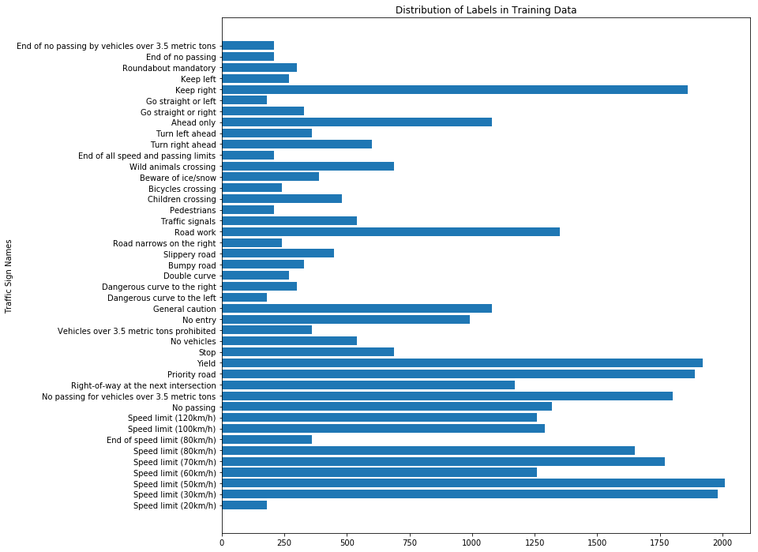
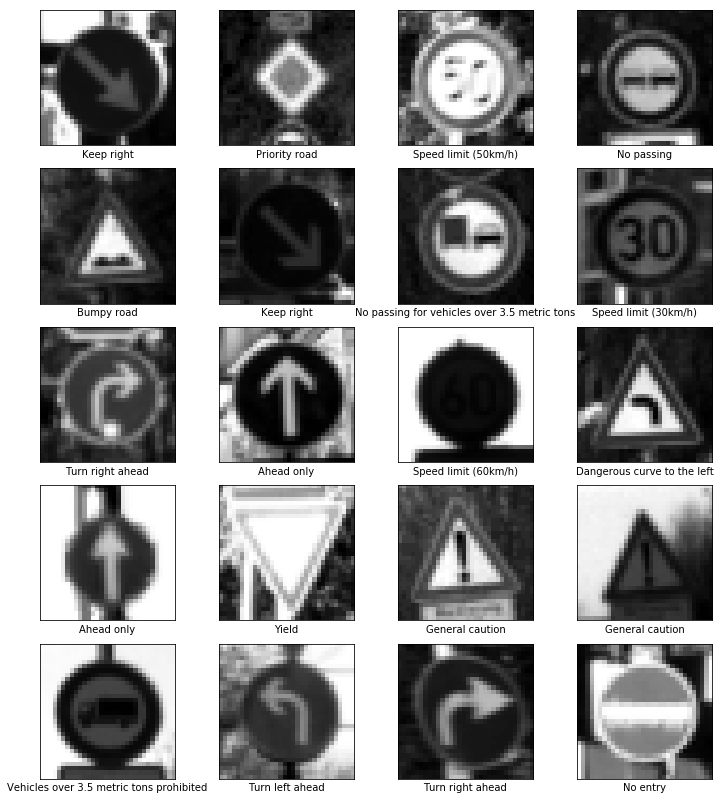

# Self-Driving Car Engineer Nanodegree

## Deep Learning

## Project: Build a Traffic Sign Recognition Classifier

In this notebook, a template is provided for you to implement your functionality in stages, which is required to successfully complete this project. If additional code is required that cannot be included in the notebook, be sure that the Python code is successfully imported and included in your submission if necessary. 

> **Note**: Once you have completed all of the code implementations, you need to finalize your work by exporting the iPython Notebook as an HTML document. Before exporting the notebook to html, all of the code cells need to have been run so that reviewers can see the final implementation and output. You can then export the notebook by using the menu above and navigating to  \n",
    "**File -> Download as -> HTML (.html)**. Include the finished document along with this notebook as your submission. 

In addition to implementing code, there is a writeup to complete. The writeup should be completed in a separate file, which can be either a markdown file or a pdf document. There is a [write up template](https://github.com/udacity/CarND-Traffic-Sign-Classifier-Project/blob/master/writeup_template.md) that can be used to guide the writing process. Completing the code template and writeup template will cover all of the [rubric points](https://review.udacity.com/#!/rubrics/481/view) for this project.

The [rubric](https://review.udacity.com/#!/rubrics/481/view) contains "Stand Out Suggestions" for enhancing the project beyond the minimum requirements. The stand out suggestions are optional. If you decide to pursue the "stand out suggestions", you can include the code in this Ipython notebook and also discuss the results in the writeup file.


>**Note:** Code and Markdown cells can be executed using the **Shift + Enter** keyboard shortcut. In addition, Markdown cells can be edited by typically double-clicking the cell to enter edit mode.

---
## Step 0: Load The Data


```python
# Load pickled data
import pickle

# TODO: Fill this in based on where you saved the training and testing data

training_file = "data/train.p"
validation_file= "data/valid.p"
testing_file = "data/test.p"

with open(training_file, mode='rb') as f:
    train = pickle.load(f)
with open(validation_file, mode='rb') as f:
    valid = pickle.load(f)
with open(testing_file, mode='rb') as f:
    test = pickle.load(f)
    
X_train, y_train = train['features'], train['labels']
X_valid, y_valid = valid['features'], valid['labels']
X_test, y_test = test['features'], test['labels']
```

---

## Step 1: Dataset Summary & Exploration

The pickled data is a dictionary with 4 key/value pairs:

- `'features'` is a 4D array containing raw pixel data of the traffic sign images, (num examples, width, height, channels).
- `'labels'` is a 1D array containing the label/class id of the traffic sign. The file `signnames.csv` contains id -> name mappings for each id.
- `'sizes'` is a list containing tuples, (width, height) representing the original width and height the image.
- `'coords'` is a list containing tuples, (x1, y1, x2, y2) representing coordinates of a bounding box around the sign in the image. **THESE COORDINATES ASSUME THE ORIGINAL IMAGE. THE PICKLED DATA CONTAINS RESIZED VERSIONS (32 by 32) OF THESE IMAGES**

Complete the basic data summary below. Use python, numpy and/or pandas methods to calculate the data summary rather than hard coding the results. For example, the [pandas shape method](http://pandas.pydata.org/pandas-docs/stable/generated/pandas.DataFrame.shape.html) might be useful for calculating some of the summary results. 

### Provide a Basic Summary of the Data Set Using Python, Numpy and/or Pandas


```python
### Replace each question mark with the appropriate value. 
### Use python, pandas or numpy methods rather than hard coding the results
import numpy as np

# TODO: Number of training examples
n_train = train['features'].shape[0]

# TODO: Number of validation examples
n_validation = valid['features'].shape[0]

# TODO: Number of testing examples.
n_test = test['features'].shape[0]

# TODO: What's the shape of an traffic sign image?
image_shape = train['sizes']

# TODO: How many unique classes/labels there are in the dataset.
n_classes = len(np.unique(train['labels']))

print("Number of training examples =", n_train)
print("Number of validation examples =", n_validation)
print("Number of testing examples =", n_test)
print("Image data shape =", image_shape)
print("Number of classes =", n_classes)
```

    Number of training examples = 34799
    Number of validation examples = 4410
    Number of testing examples = 12630
    Image data shape = [[ 26  25]
     [ 27  27]
     [ 27  28]
     ..., 
     [194 169]
     [201 175]
     [230 201]]
    Number of classes = 43
    


```python
# Randomizing Data
training = list(zip(train['features'], train['labels'], train['sizes'], train['coords']))
np.random.shuffle(training)
train['features'], train['labels'], train['sizes'], train['coords'] = zip(*training)
```

### Include an exploratory visualization of the dataset

Visualize the German Traffic Signs Dataset using the pickled file(s). This is open ended, suggestions include: plotting traffic sign images, plotting the count of each sign, etc. 

The [Matplotlib](http://matplotlib.org/) [examples](http://matplotlib.org/examples/index.html) and [gallery](http://matplotlib.org/gallery.html) pages are a great resource for doing visualizations in Python.

**NOTE:** It's recommended you start with something simple first. If you wish to do more, come back to it after you've completed the rest of the sections. It can be interesting to look at the distribution of classes in the training, validation and test set. Is the distribution the same? Are there more examples of some classes than others?


```python
### Data exploration visualization code goes here.
### Feel free to use as many code cells as needed.
import matplotlib.pyplot as plt
# Visualizations will be shown in the notebook.
%matplotlib inline
```


```python
# From https://github.com/naokishibuya/car-finding-lane-lines/blob/master/Finding%20Lane%20Lines%20on%20the%20Road.ipynb
def show_images(images, cols=2, cmap=None, labels=None):
    """Presents image in a nice grid
    """
    rows = (len(images)+1)//cols
    plt.figure(figsize=(10,11))
    for i, image in enumerate(images):
        plt.subplot(rows, cols, i+1)
        cmap = "gray" if len(image.shape) == 2 else cmap
        plt.imshow(image, cmap=cmap)
        plt.xlabel(labels[i]) if labels else None
        plt.xticks([])
        plt.yticks([])
    plt.tight_layout(pad=0, h_pad=0, w_pad=0)
    plt.show()
```


```python
import csv
sign_name_file = "signnames.csv"

SignName = dict()
with open(sign_name_file) as csvfile:
    reader = csv.reader(csvfile)
    next(reader) # Skips header
    for row in reader:
        SignName[row[0]] = row[1]
        
def get_sign_name(number):
    """Returns the name of the sign from its assigned number
    Arguments:
    number: Takes int or str as the dictionary key
    """
    number = str(number)
    return SignName[number] #RELIES ON GLOBAL SIGNNAME
```


```python
show_images(train['features'][:20], cols=4, labels=[get_sign_name(label) for label in train['labels'][:20]])
```


### Distribution of Signs in Training Data


```python
counts = np.bincount(train['labels']) # Counts for each category
plt.figure(figsize=(12,12))
plt.title("Distribution of Labels in Training Data")
plt.ylabel("Traffic Sign Names")
plt.yticks(np.arange(n_classes), [get_sign_name(num) for num in np.arange(n_classes)])
plt.barh(np.arange(n_classes), np.bincount(train['labels']))
```


    <Container object of 43 artists>





----

## Step 2: Design and Test a Model Architecture

Design and implement a deep learning model that learns to recognize traffic signs. Train and test your model on the [German Traffic Sign Dataset](http://benchmark.ini.rub.de/?section=gtsrb&subsection=dataset).

The LeNet-5 implementation shown in the [classroom](https://classroom.udacity.com/nanodegrees/nd013/parts/fbf77062-5703-404e-b60c-95b78b2f3f9e/modules/6df7ae49-c61c-4bb2-a23e-6527e69209ec/lessons/601ae704-1035-4287-8b11-e2c2716217ad/concepts/d4aca031-508f-4e0b-b493-e7b706120f81) at the end of the CNN lesson is a solid starting point. You'll have to change the number of classes and possibly the preprocessing, but aside from that it's plug and play! 

With the LeNet-5 solution from the lecture, you should expect a validation set accuracy of about 0.89. To meet specifications, the validation set accuracy will need to be at least 0.93. It is possible to get an even higher accuracy, but 0.93 is the minimum for a successful project submission. 

There are various aspects to consider when thinking about this problem:

- Neural network architecture (is the network over or underfitting?)
- Play around preprocessing techniques (normalization, rgb to grayscale, etc)
- Number of examples per label (some have more than others).
- Generate fake data.

Here is an example of a [published baseline model on this problem](http://yann.lecun.com/exdb/publis/pdf/sermanet-ijcnn-11.pdf). It's not required to be familiar with the approach used in the paper but, it's good practice to try to read papers like these.

### Pre-process the Data Set (normalization, grayscale, etc.)

Minimally, the image data should be normalized so that the data has mean zero and equal variance. For image data, `(pixel - 128)/ 128` is a quick way to approximately normalize the data and can be used in this project. 

Other pre-processing steps are optional. You can try different techniques to see if it improves performance. 

Use the code cell (or multiple code cells, if necessary) to implement the first step of your project.


```python
### Preprocess the data here. It is required to normalize the data. Other preprocessing steps could include 
### converting to grayscale, etc.
### Feel free to use as many code cells as needed.
import cv2

def grayscale(image):
    """Converts image to grayscale
    """
    image = np.copy(image)
    return cv2.cvtColor(image, cv2.COLOR_RGB2GRAY)

def scale(image, min_value=0, max_value=1):
    """Converts image to magnitude between a min/max
    """
    image = np.copy(image)
    return min_value + max_value*(image/np.max(image))

def preprocess(image):
    """Preprocessing pipeline
    Image->Gray->Scale->Output
    """
    image = np.copy(image)
    gray = grayscale(image)
    scaled = scale(gray)
    result = np.expand_dims(scaled, axis=2)
    return result

result = np.array([preprocess(img) for img in train['features'][:20]])
result = result.reshape([-1, 32, 32])
show_images(result, cols=4, labels=[get_sign_name(label) for label in train['labels'][:20]])
```





```python
train_data = [preprocess(img) for img in train['features']]
valid_data = [preprocess(img) for img in valid['features']]
test_data = [preprocess(img) for img in test['features']]
```

### Model Architecture


```python
### Define your architecture here.
### Feel free to use as many code cells as needed.
import tensorflow as tf
from tqdm import tqdm
```

#### Batches Helper Function


```python
def batches(batch_size, features, labels):
    """Creates batches for feautres and labels
    :param batch_size: The batch size
    :param features: List of features
    :param labels: List of labels
    :return: Batches of [features, labels]
    """
    assert len(features) == len(labels)
    output_batches = list()
    
    size = len(features)
    for start_i in range(0, size, batch_size):
        end_i = start_i + batch_size
        batch = [features[start_i:end_i], labels[start_i:end_i]]
        output_batches.append(batch)
        
    return output_batches
```

#### Evaluation Helper Function


```python
def evaluate(input_data, output_data):
    """Calculates the loss and accuracy of the data using the model
    :param input_data: Image data which has been preprocessed (32x32x1 Gray and Scaled)
    :param output_data: Labels of the data (Index number)
    :return: Loss, Accuracy"""
    num_examples = len(input_data)
    total_accuracy = 0
    total_loss = 0
    sess = tf.get_default_session()
    for batch_data, batch_labels in batches(batch_size, input_data, output_data):
        batch_accuracy, batch_loss = sess.run([accuracy, cross_entropy], feed_dict={inputs: batch_data,
                                                 outputs: batch_labels,
                                                 is_training: False,
                                                 keep_prob: 1.0})
        total_loss += (batch_loss * len(batch_data))
        total_accuracy += (batch_accuracy * len(batch_data))
    return total_loss / num_examples, total_accuracy / num_examples
```

### Hyperparameters


```python
modelname="traffic_classifier"

n_epochs = 100 # Max epochs
batch_size = 32
learning_rate = 0.001

# Wait time before stopping
patience = 3

# Weight Initialization
mu = 0
sigma = 0.1
```

### Convolutional Neural Network with Dropout and Batch Normalization


```python
# Input and Output placeholders
inputs = tf.placeholder(tf.float32, shape=[None, 32, 32, 1], name='inputs')
outputs = tf.placeholder(tf.int64, shape=[None], name='outputs')
one_hot_output = tf.one_hot(outputs, n_classes)
# Dropout
keep_prob = tf.placeholder(tf.float32, name='keep_prob')
# Batch Normalization
is_training = tf.placeholder(tf.bool, name='is_training')

# Convolutional Layer 1
# Input 32x32x3 Output 28x28x32
conv1_W = tf.Variable(tf.truncated_normal(shape=[5, 5, 1, 32], mean=mu, stddev=sigma))
conv1_b = tf.Variable(tf.zeros(32))
conv1 = tf.add(tf.nn.conv2d(inputs, conv1_W, strides=[1, 1, 1, 1], padding='VALID'), conv1_b)
conv1 = tf.layers.batch_normalization(conv1, training=is_training)
conv1 = tf.nn.relu(conv1)

# Output 14x14x32
pool1 = tf.nn.max_pool(conv1, ksize=[1, 2, 2, 1], strides=[1, 2, 2, 1], padding='VALID')

# Output 10x10x64
conv2_W = tf.Variable(tf.truncated_normal(shape=[5, 5, 32, 64], mean=mu, stddev=sigma))
conv2_b = tf.Variable(tf.zeros(64))
conv2 = tf.add(tf.nn.conv2d(pool1, conv2_W, strides=[1, 1, 1, 1], padding='VALID'), conv2_b)
conv2 = tf.layers.batch_normalization(conv2, training=is_training)
conv2 = tf.nn.relu(conv2)

# Output 5x5x64
pool2 = tf.nn.max_pool(conv2, ksize=[1, 2, 2, 1], strides=[1, 2, 2, 1], padding='VALID')

# Flatten Convolutional Stack
# Output 1600=(5*5*64)
flatten = tf.contrib.layers.flatten(pool2)

# Fully Connected Layer 1 with 256 nodes
fc1_W = tf.Variable(tf.truncated_normal(shape=[5*5*64, 256], mean=mu, stddev=sigma))
fc1_b = tf.Variable(tf.zeros(shape=(256)))
fc1 = tf.add(tf.matmul(flatten, fc1_W), fc1_b)
fc1 = tf.layers.batch_normalization(fc1, training=is_training)
fc1 = tf.nn.relu(fc1)
fc1 = tf.nn.dropout(fc1, keep_prob)

# Fully Connected layer 2 with 128 nodes
fc2_W = tf.Variable(tf.truncated_normal(shape=[256, 128], mean=mu, stddev=sigma))
fc2_b = tf.Variable(tf.zeros(shape=(128)))
fc2 = tf.add(tf.matmul(fc1, fc2_W), fc2_b)
fc2 = tf.layers.batch_normalization(fc2, training=is_training)
fc2 = tf.nn.relu(fc2)
fc2 = tf.nn.dropout(fc2, keep_prob)

# Output Layer Fully Connected
fc_out_W = tf.Variable(tf.truncated_normal(shape=[128, n_classes], mean=mu, stddev=sigma))
fc_out_b = tf.Variable(tf.zeros(shape=[n_classes]))
logits = tf.add(tf.matmul(fc2, fc_out_W), fc_out_b)
logits = tf.layers.batch_normalization(logits, training=is_training)

# Softmax Ouput for Probabilities
out = tf.nn.softmax(logits)

# Loss and Optimizer
cross_entropy = tf.reduce_mean(tf.nn.softmax_cross_entropy_with_logits(labels=one_hot_output, logits=logits))
with tf.control_dependencies(tf.get_collection(tf.GraphKeys.UPDATE_OPS)):
    optimizer = tf.train.AdamOptimizer(learning_rate).minimize(cross_entropy)

# Accuracy Metrics
correct_prediction = tf.equal(tf.argmax(out, 1), outputs)
accuracy = tf.reduce_mean(tf.cast(correct_prediction, tf.float32))

# Saver
saver = tf.train.Saver()
```

### Train, Validate and Test the Model

A validation set can be used to assess how well the model is performing. A low accuracy on the training and validation
sets imply underfitting. A high accuracy on the training set but low accuracy on the validation set implies overfitting.


```python
### Train your model here.
### Calculate and report the accuracy on the training and validation set.
### Once a final model architecture is selected, 
### the accuracy on the test set should be calculated and reported as well.
### Feel free to use as many code cells as needed.
best_epoch = 0
best_val_acc = 0
with tf.Session() as sess:
    sess.run(tf.global_variables_initializer())
    for epoch in range(n_epochs):
        for batch_features, batch_labels in batches(batch_size, train_data, train['labels']):
            sess.run(optimizer, feed_dict={inputs: batch_features,
                                         outputs: batch_labels,
                                         keep_prob: 0.5,
                                         is_training: True})
        train_loss, train_accuracy = evaluate(train_data, train['labels'])
        valid_loss, valid_accuracy = evaluate(valid_data, valid['labels'])
                
        training = list(zip(train_data, train['features'], train['labels'], train['sizes'], train['coords']))
        np.random.shuffle(training)
        train_data, train['features'], train['labels'], train['sizes'], train['coords'] = zip(*training)
        
        print("Epoch: {:2}, Training Loss: {:.4f}, Training Accuracy: {:.4f}, Validation Loss: {:.4f}, Validation Accuracy: {:.4f}".format(
                epoch+1, train_loss, train_accuracy, valid_loss, valid_accuracy))
        
        if valid_accuracy > best_val_acc:
            best_epoch, best_val_acc = epoch, valid_accuracy
            saver.save(sess, './{}.ckpt'.format(modelname))
            print("Model saved")
        else:
            if epoch-best_epoch == patience:
                print("Stopping after {} epochs without improvement".format(patience))
                break
```

    Epoch:  1, Training Loss: 0.5297, Training Accuracy: 0.9232, Validation Loss: 0.6997, Validation Accuracy: 0.8624
    Model saved
    Epoch:  2, Training Loss: 0.1881, Training Accuracy: 0.9796, Validation Loss: 0.3147, Validation Accuracy: 0.9454
    Model saved
    Epoch:  3, Training Loss: 0.0947, Training Accuracy: 0.9913, Validation Loss: 0.2339, Validation Accuracy: 0.9583
    Model saved
    Epoch:  4, Training Loss: 0.0520, Training Accuracy: 0.9962, Validation Loss: 0.1676, Validation Accuracy: 0.9683
    Model saved
    Epoch:  5, Training Loss: 0.0264, Training Accuracy: 0.9980, Validation Loss: 0.1337, Validation Accuracy: 0.9721
    Model saved
    Epoch:  6, Training Loss: 0.0230, Training Accuracy: 0.9978, Validation Loss: 0.1100, Validation Accuracy: 0.9776
    Model saved
    Epoch:  7, Training Loss: 0.0113, Training Accuracy: 0.9990, Validation Loss: 0.0772, Validation Accuracy: 0.9857
    Model saved
    Epoch:  8, Training Loss: 0.0086, Training Accuracy: 0.9994, Validation Loss: 0.0749, Validation Accuracy: 0.9850
    Epoch:  9, Training Loss: 0.0154, Training Accuracy: 0.9984, Validation Loss: 0.0840, Validation Accuracy: 0.9864
    Model saved
    Epoch: 10, Training Loss: 0.0046, Training Accuracy: 0.9995, Validation Loss: 0.0568, Validation Accuracy: 0.9871
    Model saved
    Epoch: 11, Training Loss: 0.0029, Training Accuracy: 0.9998, Validation Loss: 0.0618, Validation Accuracy: 0.9855
    Epoch: 12, Training Loss: 0.0188, Training Accuracy: 0.9986, Validation Loss: 0.0847, Validation Accuracy: 0.9848
    Epoch: 13, Training Loss: 0.0031, Training Accuracy: 0.9997, Validation Loss: 0.0429, Validation Accuracy: 0.9912
    Model saved
    Epoch: 14, Training Loss: 0.0027, Training Accuracy: 0.9997, Validation Loss: 0.0668, Validation Accuracy: 0.9850
    Epoch: 15, Training Loss: 0.0019, Training Accuracy: 0.9998, Validation Loss: 0.0533, Validation Accuracy: 0.9889
    Epoch: 16, Training Loss: 0.0016, Training Accuracy: 0.9998, Validation Loss: 0.0447, Validation Accuracy: 0.9893
    Stopping after 3 epochs without improvement
    

### Test Data Evaluation


```python
import os
with tf.Session() as sess:
    saver.restore(sess, tf.train.latest_checkpoint('.'))
    
    test_loss, test_accuracy = evaluate(test_data, test['labels'])
    print("Test Data Accuracy: {}".format(test_accuracy))
    
    test_predictions = []
    for batch_data, batch_labels in batches(batch_size, test_data, test['labels']):
        batch_predictions = sess.run(out, feed_dict={inputs: batch_data,
                                                     outputs: batch_labels,
                                                     is_training: False,
                                                     keep_prob: 1.0})
        test_predictions.extend(np.argmax(batch_predictions,1))
```

    INFO:tensorflow:Restoring parameters from .\traffic_classifier.ckpt
    Test Data Accuracy: 0.9755344418524186
    

### Confusion Matrix

For the most part, the classifier is very certain that it has classified an image correctly


```python
from sklearn.metrics import confusion_matrix
plt.figure(figsize=(12,12))

# https://github.com/viadanna/sdc-traffic-sign-classifier
cm = confusion_matrix(test['labels'], test_predictions)
cm = cm.astype('float') / cm.sum(axis=1)[:, np.newaxis]
plt.title("Confusion Matrix of Traffic Sign Classifier")
plt.xlabel("True Labels of Signs")
plt.ylabel("Classifier's Predicted Labels of Signs")
plt.imshow(cm, interpolation='nearest', cmap='bwr')
print(plt.yticks)
plt.colorbar()
```

    <function yticks at 0x000001E82A5B2E18>
    


    <matplotlib.colorbar.Colorbar at 0x1e9135d2828>


---

## Step 3: Test a Model on New Images

To give yourself more insight into how your model is working, download at least five pictures of German traffic signs from the web and use your model to predict the traffic sign type.

You may find `signnames.csv` useful as it contains mappings from the class id (integer) to the actual sign name.

### Load and Output the Images


```python
### Load the images and plot them here.
### Feel free to use as many code cells as needed.
import glob
original_images = [plt.imread(img) for img in glob.glob("test_images/*.jpg")]
resized_images = [cv2.resize(img, (32, 32)) for img in original_images]
test_labels = [11, 14, 13, 13, 18]
processed_images = [preprocess(img) for img in resized_images]
show_images(original_images, cols=3)
```


### Predict the Sign Type for Each Image


```python
### Run the predictions here and use the model to output the prediction for each image.
### Make sure to pre-process the images with the same pre-processing pipeline used earlier.
### Feel free to use as many code cells as needed.
with tf.Session() as sess:
    saver.restore(sess, tf.train.latest_checkpoint('.'))
    probabilities = sess.run(out, feed_dict={inputs : processed_images,
                                                        outputs: test_labels,
                                                        is_training: False,
                                                        keep_prob: 1.0})
    predictions = np.argmax(probabilities, axis=1)
```

    INFO:tensorflow:Restoring parameters from .\traffic_classifier.ckpt
    

### Analyze Performance


```python
### Calculate the accuracy for these 5 new images. 
### For example, if the model predicted 1 out of 5 signs correctly, it's 20% accurate on these new images.
with tf.Session() as sess:
    saver.restore(sess, tf.train.latest_checkpoint('.'))
    print(sess.run(accuracy, feed_dict={inputs : processed_images,
                                                        outputs: test_labels,
                                                        is_training: False,
                                                        keep_prob: 1.0}))
```

    INFO:tensorflow:Restoring parameters from .\traffic_classifier.ckpt
    0.8
    

### Output Top 5 Softmax Probabilities For Each Image Found on the Web

For each of the new images, print out the model's softmax probabilities to show the **certainty** of the model's predictions (limit the output to the top 5 probabilities for each image). [`tf.nn.top_k`](https://www.tensorflow.org/versions/r0.12/api_docs/python/nn.html#top_k) could prove helpful here. 

The example below demonstrates how tf.nn.top_k can be used to find the top k predictions for each image.

`tf.nn.top_k` will return the values and indices (class ids) of the top k predictions. So if k=3, for each sign, it'll return the 3 largest probabilities (out of a possible 43) and the correspoding class ids.

Take this numpy array as an example. The values in the array represent predictions. The array contains softmax probabilities for five candidate images with six possible classes. `tf.nn.top_k` is used to choose the three classes with the highest probability:

```
# (5, 6) array
a = np.array([[ 0.24879643,  0.07032244,  0.12641572,  0.34763842,  0.07893497,
         0.12789202],
       [ 0.28086119,  0.27569815,  0.08594638,  0.0178669 ,  0.18063401,
         0.15899337],
       [ 0.26076848,  0.23664738,  0.08020603,  0.07001922,  0.1134371 ,
         0.23892179],
       [ 0.11943333,  0.29198961,  0.02605103,  0.26234032,  0.1351348 ,
         0.16505091],
       [ 0.09561176,  0.34396535,  0.0643941 ,  0.16240774,  0.24206137,
         0.09155967]])
```

Running it through `sess.run(tf.nn.top_k(tf.constant(a), k=3))` produces:

```
TopKV2(values=array([[ 0.34763842,  0.24879643,  0.12789202],
       [ 0.28086119,  0.27569815,  0.18063401],
       [ 0.26076848,  0.23892179,  0.23664738],
       [ 0.29198961,  0.26234032,  0.16505091],
       [ 0.34396535,  0.24206137,  0.16240774]]), indices=array([[3, 0, 5],
       [0, 1, 4],
       [0, 5, 1],
       [1, 3, 5],
       [1, 4, 3]], dtype=int32))
```

Looking just at the first row we get `[ 0.34763842,  0.24879643,  0.12789202]`, you can confirm these are the 3 largest probabilities in `a`. You'll also notice `[3, 0, 5]` are the corresponding indices.


```python
### Print out the top five softmax probabilities for the predictions on the German traffic sign images found on the web. 
### Feel free to use as many code cells as needed.
with tf.Session() as sess:
    saver.restore(sess, tf.train.latest_checkpoint('.'))
    top5 = sess.run(tf.nn.top_k(out, k=5), feed_dict={inputs : processed_images,
                                                        outputs: test_labels,
                                                        is_training: False,
                                                        keep_prob: 1.0})
```

    INFO:tensorflow:Restoring parameters from .\traffic_classifier.ckpt
    


```python
def display_online_image(img, label, probabilities, names):
    plt.subplots(1, 2, figsize=(20,5))
    ax1 = plt.subplot(1,2,2)
    for i, v in enumerate(probabilities):
        # X-offset, Y-offet, Label
        ax1.text(v*100+2, i+0.1, "{:.1f}%".format(v*100), fontsize=20)
    ax1.set_xlim(0,100)
    plt.gca().invert_yaxis()
    for tick in ax1.yaxis.get_major_ticks():
        tick.label.set_fontsize(10)
    plt.barh(np.arange(5), probabilities*100, tick_label=[get_sign_name(num) for num in names])
    
    ax2 = plt.subplot(1,2,1)
    plt.title(label, fontsize=20)
    plt.imshow(img)
    
[display_online_image(img, get_sign_name(test_labels[i]), top5[0][i], top5[1][i]) for i, img in enumerate(original_images)];
```


### Project Writeup

Once you have completed the code implementation, document your results in a project writeup using this [template](https://github.com/udacity/CarND-Traffic-Sign-Classifier-Project/blob/master/writeup_template.md) as a guide. The writeup can be in a markdown or pdf file. 

> **Note**: Once you have completed all of the code implementations and successfully answered each question above, you may finalize your work by exporting the iPython Notebook as an HTML document. You can do this by using the menu above and navigating to  \n",
    "**File -> Download as -> HTML (.html)**. Include the finished document along with this notebook as your submission.

---

## Step 4 (Optional): Visualize the Neural Network's State with Test Images

 This Section is not required to complete but acts as an additional excersise for understaning the output of a neural network's weights. While neural networks can be a great learning device they are often referred to as a black box. We can understand what the weights of a neural network look like better by plotting their feature maps. After successfully training your neural network you can see what it's feature maps look like by plotting the output of the network's weight layers in response to a test stimuli image. From these plotted feature maps, it's possible to see what characteristics of an image the network finds interesting. For a sign, maybe the inner network feature maps react with high activation to the sign's boundary outline or to the contrast in the sign's painted symbol.

 Provided for you below is the function code that allows you to get the visualization output of any tensorflow weight layer you want. The inputs to the function should be a stimuli image, one used during training or a new one you provided, and then the tensorflow variable name that represents the layer's state during the training process, for instance if you wanted to see what the [LeNet lab's](https://classroom.udacity.com/nanodegrees/nd013/parts/fbf77062-5703-404e-b60c-95b78b2f3f9e/modules/6df7ae49-c61c-4bb2-a23e-6527e69209ec/lessons/601ae704-1035-4287-8b11-e2c2716217ad/concepts/d4aca031-508f-4e0b-b493-e7b706120f81) feature maps looked like for it's second convolutional layer you could enter conv2 as the tf_activation variable.

For an example of what feature map outputs look like, check out NVIDIA's results in their paper [End-to-End Deep Learning for Self-Driving Cars](https://devblogs.nvidia.com/parallelforall/deep-learning-self-driving-cars/) in the section Visualization of internal CNN State. NVIDIA was able to show that their network's inner weights had high activations to road boundary lines by comparing feature maps from an image with a clear path to one without. Try experimenting with a similar test to show that your trained network's weights are looking for interesting features, whether it's looking at differences in feature maps from images with or without a sign, or even what feature maps look like in a trained network vs a completely untrained one on the same sign image.

<figure>
 
 <figcaption>
 <p></p> 
 <p style="text-align: center;"> Your output should look something like this (above)</p> 
 </figcaption>
</figure>
 <p></p> 


```python
### Visualize your network's feature maps here.
### Feel free to use as many code cells as needed.

# image_input: the test image being fed into the network to produce the feature maps
# tf_activation: should be a tf variable name used during your training procedure that represents the calculated state of a specific weight layer
# activation_min/max: can be used to view the activation contrast in more detail, by default matplot sets min and max to the actual min and max values of the output
# plt_num: used to plot out multiple different weight feature map sets on the same block, just extend the plt number for each new feature map entry

def outputFeatureMap(image_input, tf_activation, activation_min=-1, activation_max=-1 ,plt_num=1):
    # Here make sure to preprocess your image_input in a way your network expects
    # with size, normalization, ect if needed
    # image_input =
    # Note: x should be the same name as your network's tensorflow data placeholder variable
    # If you get an error tf_activation is not defined it may be having trouble accessing the variable from inside a function
    activation = tf_activation.eval(session=sess,feed_dict={inputs : image_input,
                                                            is_training: False,
                                                            keep_prob: 1.0})
    featuremaps = activation.shape[3]
    plt.figure(plt_num, figsize=(15,15))
    for featuremap in range(featuremaps):
        plt.subplot(8,8, featuremap+1) # sets the number of feature maps to show on each row and column
        plt.title('FeatureMap ' + str(featuremap)) # displays the feature map number
        if activation_min != -1 & activation_max != -1:
            plt.imshow(activation[0,:,:, featuremap], interpolation="nearest", vmin =activation_min, vmax=activation_max, cmap="gray")
        elif activation_max != -1:
            plt.imshow(activation[0,:,:, featuremap], interpolation="nearest", vmax=activation_max, cmap="gray")
        elif activation_min !=-1:
            plt.imshow(activation[0,:,:, featuremap], interpolation="nearest", vmin=activation_min, cmap="gray")
        else:
            plt.imshow(activation[0,:,:, featuremap], interpolation="nearest", cmap="gray")
```


```python
idx = np.random.randint(0, len(train['features']))
image = train['features'][idx]
label = train['labels'][idx]
processed_image = np.expand_dims(preprocess(image), axis=0)
plt.xlabel("Feature Map for {}".format(get_sign_name(label)))
plt.imshow(image)
```


    <matplotlib.image.AxesImage at 0x213b653b898>


```python
with tf.Session() as sess:
    saver.restore(sess, tf.train.latest_checkpoint('.'))
    outputFeatureMap(processed_image, conv1, plt_num=1)
    outputFeatureMap(processed_image, conv2, plt_num=2)
```

    INFO:tensorflow:Restoring parameters from .\traffic_classifier.ckpt
    


